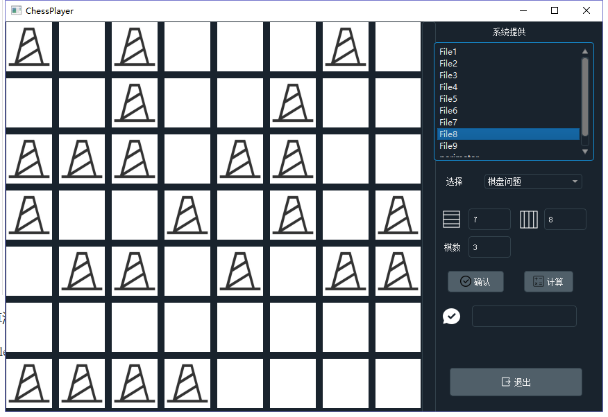

# chessProblem
棋盘问题，可视化求解

---

> 在一个给定形状的棋盘（形状可能是不规则的）上面摆放棋子，棋子没有区别。要求摆放时任意的两个棋子不能放在棋盘中的同一行或者同一列，请编程求解对于给定形状和大小的棋盘，摆放k个棋子的所有可行的摆放方案C。
>
> 输入：每组数据的第一行是两个正整数，n k，用一个空格隔开，表示了将在一个n*n的矩阵内描述棋盘，以及摆放棋子的数目。 n <= 8 , k <= n 随后的n行描述了棋盘的形状：每行有n个字符，其中 # 表示棋盘区域， . 表示空白区域（数据保证不出现多余的空白行或者空白列）。
>
> 输出：对于每一组数据，给出一行输出，输出摆放的方案数目C （数据保证C<2^31）。
>
>  
>
> 样例1：
>
> 2 1
>
> \#.
>
> .#
>
> 输出1：
>
> 2
>
> 样例2：
>
> 4 4
>
> ...#
>
> ..#.
>
> .#..
>
> \#...
>
> 输出2：
>
> 1

算法：回溯法

release: 需要将exe文件放在与Data文件夹同目录的位置，才能使用。

自定义棋盘：

